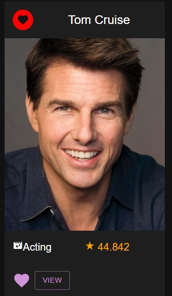
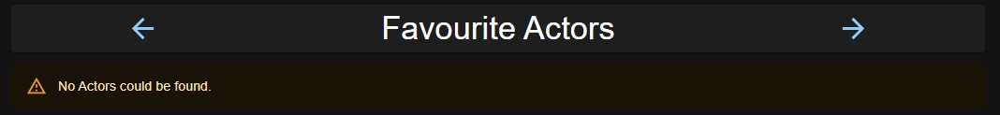
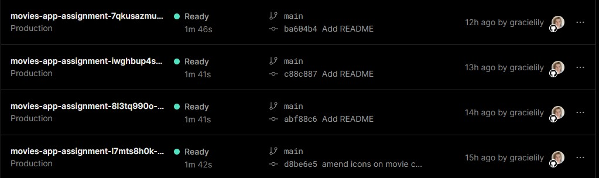

# Full Stack Development 2 - Assignment.

__Name:__ Grace Kelly

## Features.

+ Trending Actors
+ Actor Details
+ Similar Movies/TV Shows
+ Tv Shows
+ Tv Show Details
+ Trending Actors
+ Actor Details
+ Favourite Actors
+ Upcoming Movies
+ Top Rated Movies
+ TV Shows
+ TV Show Details
+ Favourite TV Shows
+ Fantasy Movies
+ Fantasy Movie Form
+ Fantasy Movie Details
+ Playlists
+ Create Playlist
+ Playlsit Details
+ Add Movie to Playlist
+ User Login
+ User Signup
+ User Logout
+ Multi Criteria Search
+ Sort Movies/TV Shows
+ Filter Movies/TV Shows
+ Pagination
+ Extended Movie Details
+ Authentication
+ Protected Routes/Functionality
+ Data Hyperlinking
+ Server State Caching
+ Supabase used
+ Deployed to Vercel

## Feature Design.

#### Trending Actors

> Lists trending actors from Trending People endpoint of TMDB.

> Click 'View' link in card to view Actor Details and Click 'Add to Favourites' to add Actor to Favourite Actors

#### Actor Details

> Displays overview of actor from People Details endpoint of TMDB

> Also displays movie credits of actor (retrieved using Combined Credits TMDB Endpoint). Clicking on row brings 
user to details page of that movie.

> Clicking on IMDB Button brings user to actor's IMDB Page

#### Favourite Actors

> Lists actors that user has added to favourites

> Order of actors can be changed via arrow buttons

> Actor can be deleted from list

> If no favourite actors, message is displayed

#### Upcoming Movies

> Lists Movies from Upcoming Movies endpoint of TMDB.

> Movie can be added to watchlist

#### Top Rated Movies

> Lists Movies from Top Rated Movies endpoint of TMDB.

> Movie can be added to favourites

#### TV Shows

> Lists TV Shows from List TV endpoint of TMDB.

> Tv Show can be added to favourites

#### TV Show Details

> Displays overview of TV Show from TV Details endpoint of TMDB. Displays Snapshot of Cast and Videos (videos 
retrieved using TV Videos Endpoint)

> Displays Similar TV Shows (retrieved using Similar TV TMDB Endpoint). Clicking on table row brings user to details page
of that TV Show.

> If user clicks on "Watch" icon, brought to where the show can be viewed e.g Netflix/BBC iplayer

#### Favourite TV Shows

> Lists TV Shows that user has added to favourites. Order of Tv Shows can be changed and 
TV Show can be deleted from list (same as favourite movies/actors)

> User can click on Write Review Button to be brought to Write Review Page

#### Fantasy Movies

> Fantasy Movies Listed, displays title, poster (if one is uploaded) and shows options to delete/view

> If none, displays alert message

#### Create a Fantasy Movie

> Form where user enters in fantasy movie details (title, overview, genres, release date, production company
 poster image and cast)

 

> Can select multiple genres (options retrieved from Genres List TMDB Endpoint)

> Release date is a datepicker component with current date as default

> Can add multiple cast members

> Can delete each row if no longer wish to add cast member (below is after deleting rows)

> Submitting form displays success message and redirects back to list page

#### Fantasy Movie Details

> Displays Fantasy Movie information

#### Playlists

> Lists playlists created by user

> If no playlists, displays alert message

> Clicking 'Create Playlist' displays dialog with form, submitting form creates a playlist and adds to list

#### Playlist Details

> Displays Playlists overview with movies belonging to list displayed in table

> Movies can be deleted from the playlist using delete option in table (table after deleting movie)

> If no movies listed, message is displayed

#### Add Movie to Playlist

> If playlist has been created, user sees add to playlist icon on movie card

> Clicking this presents user with dialog and dropdown of playlists to choose from

> Selecting playlist, adds movie to it and displays icon on movie card. When icon is hovered over, tooltip is displayed
listing which playlist(s) the movie has been added to

#### User Login/Logout

> Form which user enters in credentials to login to application (stored in Supabase Authentication)

> If credentials are invalid, message is displayed

> When user logs out, it unsets the session and user is redirected back to login page.

#### User Signup

> User can provide email and password in order to create a user for the appliation (stored in supabase). User
must confirm their email before they can proceed to login to app.

#### Multi Criteria Search
> User can search for movies/tv shows with a specific title, release year, language. They can also choose whether to include adult in the results 
by checking the checkbox. Querieds the Search TMDB Endpoint.

> If no results found, message is displayed

#### Sort Movies/TV Shows

> Movies/TV Shows can be sorted by the following in ascending/descending order: revenue, release date, vote average

> Movies sorted by revenue (desc)

#### Extended Filters

> Movies/TV Shows can be filtered by the following: genre, release year, language, vote average (gte), vote average (lte). Genres and Languages 
are retrieved using respective TMDB endpoints and the release year is a datepicker component.

Movies filtered by Music genre

Movies filterd by release year of 2001

> TV Shows can also be filtered using the above criteria. Example of TV Shows being filtered by Animation genre:

#### Pagination

> Pagination added to home page, upcoming movies, top rated movies and tv shows pages. Total results displayed.

> Clicking arrow/number displays an updated list of results

#### Reorder Favourites/Watchlist

> Cards in list can be reorderd. If the element is first on the list, it can only be moved down. 
If it is last on the list it can only be moved up.

#### Extended Movie Details

> Cast Snapshot, Videos and Similar Movies added to Movie Details page

#### Data Hyperlinking

Multiple links across site: 
 - navbar links to different pages on site
 - links to view movie/tv/actor from cards
 - forward/back and home links on page header
 - link to write review both from card and from within details page
 - link to view review details in reviews table
 - link to add movies to playlist from playlist details page
 - link to visit movie/tv show details page within similar movies/tv table
 - external links to actor's imdb page and to tv show's page to watch it.

#### Server State Caching

Made use of [server state caching](https://github.com/gracielily/MoviesAppAssignment/blob/main/src/index.jsx#L42) using `react-query`

## Storybook.

No added storybook stories beyond previous lab work

## Authentication

Authentication added using supabase, user must login in order to access 
all pages/features. Token set on login and is unset when user logs out.

#### Protected routes 

+ / - Homepage - lists all movies
+ /login - Login to application
+ /login - Signup to application
+ /movies/upcoming - List of upcoming movies
+ /movies/top - Top Rated Movies
+ /movies/{id} (Protected) - Movie Details
+ /movies/watchlist (Protected) - List movies marked as must watch
+ /movies/favourites (Protected) - Favourite Movies
+ /tvshows - List of tv shows
+ /tvshows/{id} (Protected) - TV Show Details
+ /tvshows/favourites (Protected) - Favourite TV Shows
+ /trending-actors/ - List of actors that are trending
+ /actors/{id} (Protected) - Actor Details
+ /actors/favourites (Protected) - Favourite Actors
+ /reviews/{id} (Protected) - Review Details
+ /reviews/form (Protected) - Add a new review
+ /fantasy-movies (Protected) - List of fantasy movies
+ /fantasy-movies/{id} (Protected) - Fantasy Movie Details
+ /fantasy-movies/form (Protected) - Create a new fantasy movie
+ /search (Protected) - Search for a specific movie
+ /playlists (Protected) - List of playlists
+ /playlists/{id} (Protected) - Playlist Details

#### Protected functionality

> Only Authenticated users can filter movies/tv shows if not logged in the following is displayed:

> Only authenticated users can see option to view a movie/tv show/actor and to add to favourites/watchlist/playlist and also to write a review, 
if not logged in these options are not visible on the movie card.

> Private page links are displayed on navbar only if user is authenticated

Unauthenticated User Navbar:

Authenticated User Navbar:

#### Supabase 

> Supabase Setup

> Supabase Authentication (users storage)

> Supabase Storage (fantasy movie poster storage)

## Deployment

Username: 12722041@mail.wit.ie ; Password: admin

URL: https://movies-app-assignment-eight.vercel.app/

Vercel Project Details:

Project Deployments Snapshot:

## Additional Information

> Featured Card displayed at top of page above list of movies and tv shows

> User Review added to top of Reviews 

> When Form submitted, button changes to display 'submitting' and form buttons are disabled

